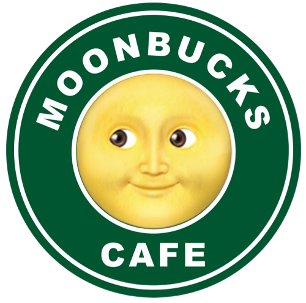

  

<h2 align="center">☕️블랙커피 Vanilla JS 카페 메뉴 앱 만들기</h2>

Vanilla JS로 구현 하는 상태관리가 가능한 카페메뉴 앱

    <a href="https://www.udemy.com/course/vanilla-js-lv1/">🔗 블랙커피 Vanilla JS 카페 메뉴 앱 만들기 링크 바로가기</a>

 

## 🎯 요구사항 구현을 위한 전략
**`TODO 메뉴 추가`**
- [ ] 에스프레소 메뉴에 새로운 메뉴를 확인 버튼 또는 엔터키 입력으로 추가한다.    
    => 메뉴 이름을 입력 받고 확인 버튼을 누르면 메뉴가 추가된다.    
    => 메뉴 이름을 입력 받고 엔터키 입력으로 추가한다.
    - [ ] 추가되는 메뉴의 아래 마크업은 `<ul id="espresso-menu-list" class="mt-3 pl-0"></ul>` 안에 삽입해야 한다.
    - [ ] (추가👉) 총 메뉴 갯수를 count하여 상단에 보여준다.
    - [ ] 메뉴가 추가되고 나면, input은 빈 값으로 초기화한다.
    - [ ] 사용자 입력값이 빈 값이라면 추가되지 않는다.

**`TODO 메뉴 수정`**
- [ ] 메뉴의 수정 버튼을 눌러 메뉴 이름 수정할 수 있다.    
    => 메뉴의 수정 버튼 클릭 이벤트를 받고, 메뉴 이름을 업데이트 한다.    
    - [ ] 메뉴 수정시 브라우저에서 제공하는 `prompt` 인터페이스를 활용한다.    
    => 메뉴 수정 버튼 클릭 이벤트를 받고, 메뉴를 수정할 수 있는 입력창(prompt)이 뜬다.     
    => 입력창(prompt)에서 신규 메뉴명을 입력 받고, 확인 버튼을 누르면 메뉴가 수정된다.
        
**`TODO 메뉴 삭제`**
- [ ] 메뉴 삭제 버튼을 이용하여 메뉴 삭제할 수 있다.    
    => 메뉴 삭제 버튼 클릭 이벤트를 받아 삭제한다.
    - [ ] 메뉴 삭제시 브라우저에서 제공하는 `confirm` 인터페이스를 활용한다.     
        => 삭제하기 전에 메뉴 삭제 컨펌 알럿창(confirm 인터페이스)이 뜬다.    
        => 확인 버튼을 클릭하면 메뉴가 삭제된다.      
- [ ] 총 메뉴 갯수를 count하여 상단에 보여준다.